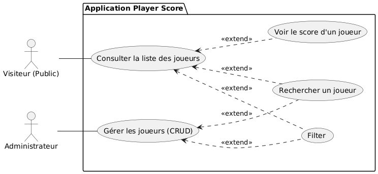
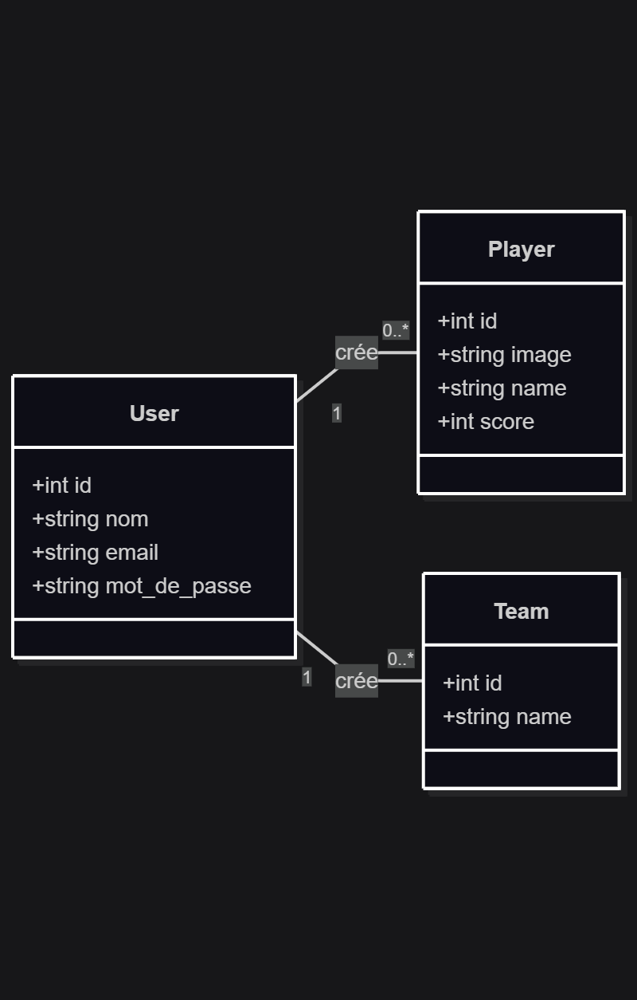

# Player Score  
### Application de gestion des scores des joueurs
Realisé par : **Mohamed Ouallou** 
Encadré par : **M.ESSARAJ Fouad**

---

## Travail a faire

### Développer l'Application Player Score

**Partie Publique:** Interface permettant aux visiteurs de consulter les players et leurs scores.
**Partie Admin:** Tableau de bord sécurisé pour les opérations CRUD.
Fonctionnalités : Modales pour ajout/édition, AJAX pour les mises à jour asynchrones.

---

## Methode waterfall (en cascade)

---

## Contexte – Travail sur le projet de fin de formation

**Projet de Fin de Formation :** Travail sur le projet de fin de formation, commençant par la branche technique.

---

## Exigences : Analyse Technique

### __Technologies a Utilisées__
1. **Base de données** : MySQL.
2. **Architecture N-tiers** : Services.
3. **Framework** : Laravel.
4. **Architecture** : MVC.
5. **Moteur de vue** : Blade.
---
6. **AJAX** : Interactions dynamiques sans rechargement.
7. **Upload Image** : upload d'images.
8. **Laravel multi-lang** : Interface multilingue.
9. **Vite** : L'outil de construction moderne.
10. **Preline** : Gestion des composants UI.
11. **Tailwind CSS** : Framework CSS utilitaire.
12. **CSS** : Tailwind CSS.
---

## Analyse - Analyse fonctionnelle

L’application est basée sur deux types d’acteurs :

- **Visiteur (Public)**.
- **Administrateur**.

---

## Conception : Diagram de Classes

---

## Versions

### Version 1

- Public Side
- Branch : public

### Version 2

- Admin Side
- Branch : admin

### Version 3

- Authontification / Authorization (Gates)
- Branch : gates

---

### Version 4

- SPA (Single Page Application) / AJAX - Alpine.js
- Branch : spa

### Version 5

- Spatie / Authorization
- Branch : spatie

### Version 6

- API
- Branch : api

### Version 7

- Mobile App
- Branch : mobile

---

## Sujet - Live coding

* Un bouton “Ajouter” qui ouvre une modale pour créer un nouvel élément.
* Une barre de recherche filtrant des éléments par joueur.