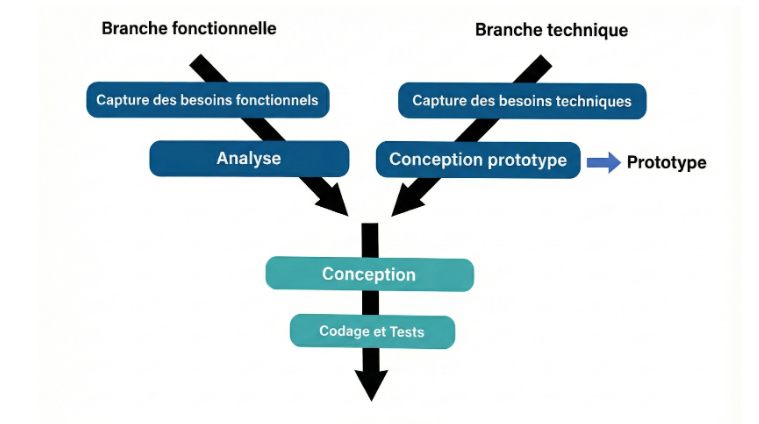

# Player Score  
### Application de gestion des scores des joueurs

---

## Contexte – Player Score

Le projet **Player Score** permet de centraliser les informations liées aux joueurs de suivre l’évolution de leurs performances.

---

## Objectifs du projet

- Comprendre la **conception générique** d’une application CRUD  
- Séparer la **partie fonctionnelle** de la **réalisation technique**  
- Mettre en pratique les opérations :
  - Ajouter
  - Lire
  - Modifier
  - Supprimer
- Respecter une **méthodologie structurée (2TUP)**

---

## Besoin – Analyse Technique

L’application est basée sur deux types d’acteurs :

- **Utilisateur (Public)**
- **Administrateur**

Chaque acteur dispose de fonctionnalités spécifiques.

---

## Acteur : Utilisateur (Public)

L’utilisateur public peut :

- Consulter la liste des joueurs
- Voir le score de chaque joueur
- Rechercher un joueur par :
  - Nom
  - Équipe
- Consulter les scores avec **pagination**

---

## Acteur : Administrateur (Admin)

L’administrateur peut :

- Ajouter un nouveau joueur
- Modifier les informations d’un joueur
- Supprimer un joueur
- Consulter la liste complète des joueurs
- Rechercher un joueur
- Gérer l’affichage avec **pagination**

---

## Analyse Fonctionnelle